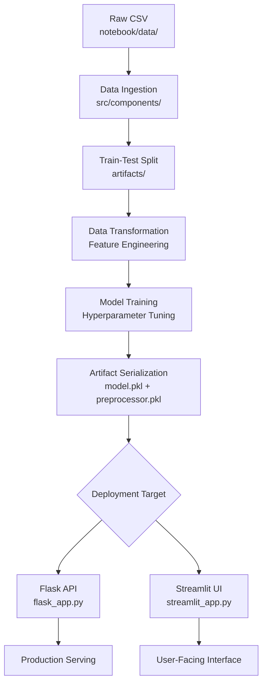

```mermaid
flowchart TD
    A[Raw CSV<br/>notebook/data/] --> B[Data Ingestion<br/>src/components/]
    B --> C[Train-Test Split<br/>artifacts/]
    C --> D[Data Transformation<br/>Feature Engineering]
    D --> E[Model Training<br/>Hyperparameter Tuning]
    E --> F[Artifact Serialization<br/>model.pkl + preprocessor.pkl]
    F --> G{Deployment Target}
    G --> H[Flask API<br/>flask_app.py]
    G --> I[Streamlit UI<br/>streamlit_app.py]
    H --> J[Production Serving]
    I --> K[User-Facing Interface]
```